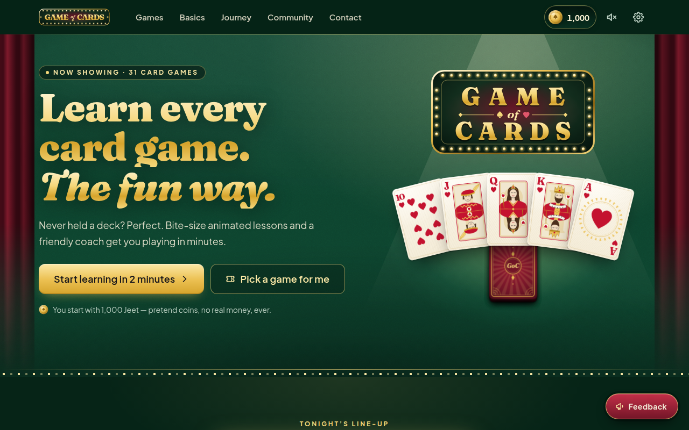
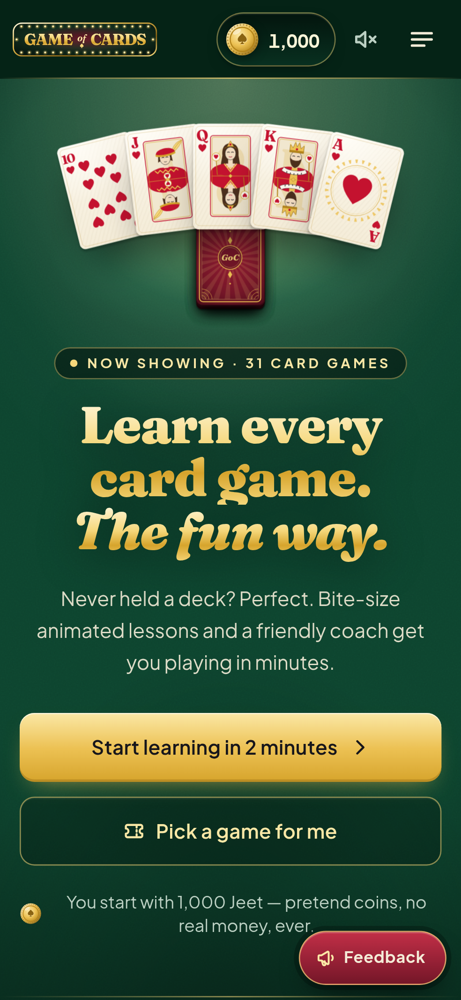
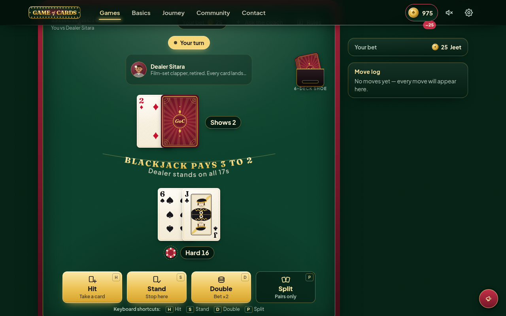
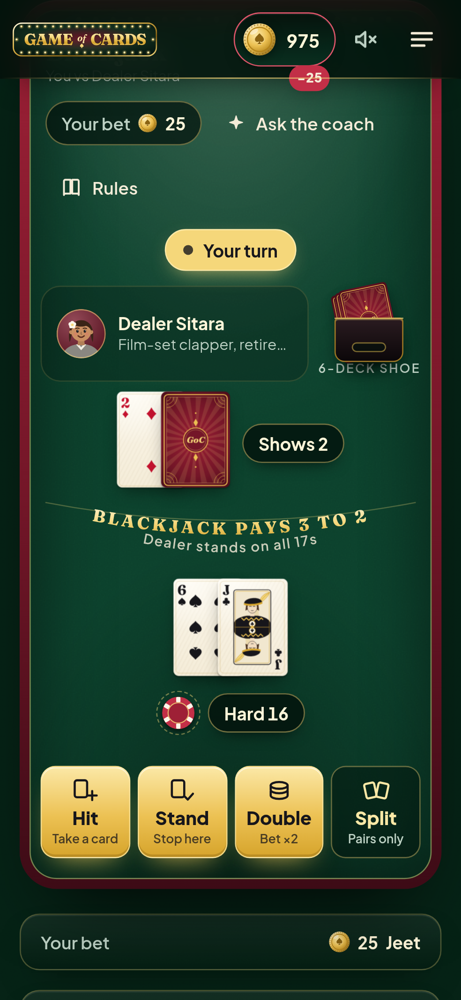
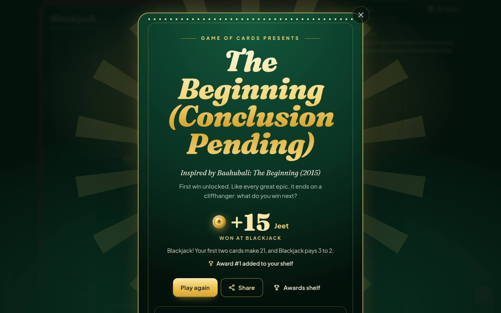
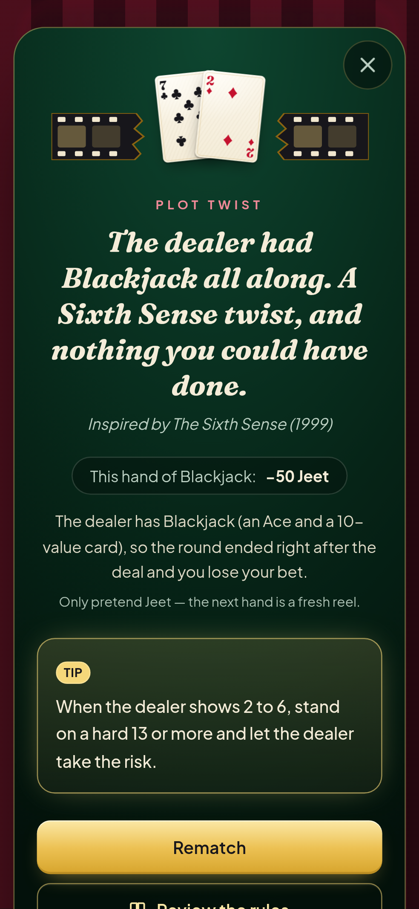
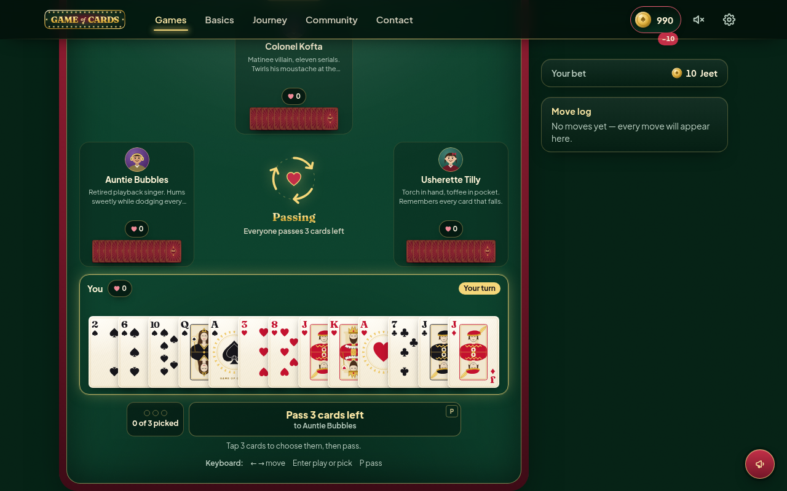
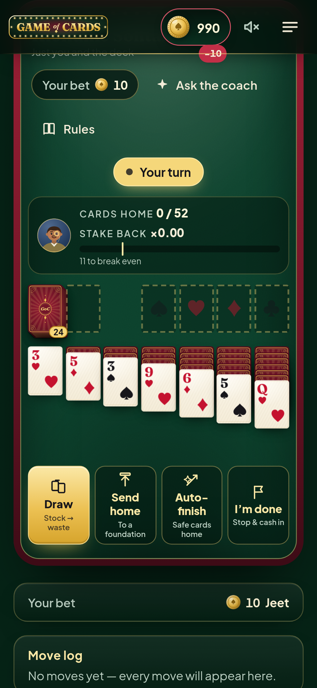

# Game of Cards

**Learn every card game. The fun way.**

Game of Cards teaches card games to people who have never held a deck. Every game has a
short animated lesson, an interactive example hand with a friendly Coach, and a 5-question
quiz. Twelve games are fully playable against original bot characters, using **Jeet**, a
pretend currency. Win and you earn a filmy title; lose and you get a gentle roast plus a
real tip.

> Jeet is pretend money for learning. No real money, ever. It cannot be bought, sold,
> withdrawn or exchanged, and the site has no purchase or payment flow of any kind.

| Desktop                                                          | Mobile (375 px)                                                           |
| ---------------------------------------------------------------- | ------------------------------------------------------------------------- |
|             |             |
|  |  |
|    |         |
|              |                    |

More screenshots are in [`docs/screenshots/`](docs/screenshots/).

## Features

- **31 card games from around the world.** You can filter the catalog by region, type, difficulty, player count and mood.
  - **Tier 1 (12 games: lesson + coached hand + play vs bot + quiz):** Blackjack, Teen Patti, Andar Bahar, Indian Rummy (13-card), Texas Hold'em, Baccarat, Hearts, Spades, Crazy Eights, Go Fish, War, Klondike Solitaire.
  - **Tier 2 (19 games: lesson + scripted interactive hand + quiz):** Gin Rummy, Bridge (intro), Twenty-Nine, Mendikot, Durak, Scopa, Briscola, Tiến Lên, Big Two, Belote, Skat, Euchre, Cribbage, Canasta, President, FreeCell, Spider Solitaire, Old Maid, Cheat.
- **60-second Card Basics primer:** deck, suits, ranks, face cards, hand, trick, trump and meld, all tap-to-learn. You can skip it.
- **Lesson player:** one concept per screen with animated card scenes, glossary popovers, a progress bar, and ←/→ keys.
- **Coach:** explains what's happening and highlights your legal moves. It also says _why_ a move is illegal when you try it. "What would a pro do?" shows the coach's pick, and "Play it for me" makes that move. You can also switch the coach on during real play.
- **Jeet wallet:** you start with 1,000 Jeet. The header wallet animates every change.
  - **Escrow betting** covers every game type: casino bets, pot games, points rummy and Vegas-style solitaire.
  - **Daily Udhaar** gives you a 500 Jeet refill once every 24 hours when your balance drops below 100.
- **Filmy win titles and cheeky roasts:** 106 lines drawing on Bollywood, Hollywood and South Indian cinema.
  - They match what happened in the game: first win, a streak, a comeback, a big pot, a close finish, a lucky last card, or a game-specific moment.
  - The same line never appears twice in a row.
  - Every roast comes with a tip for the game you lost.
  - Any title can be shared as a generated poster image.
- **Your progress:** stats, an Awards Shelf, and a "Your learning journey" map. Each game moves from not started to learning, learned and mastered. Everything is stored in localStorage, so no login is needed.
- **Community Board:** posts, one upvote per browser, comments, sorting and type filters. A Feedback button floats on every page.
  - **Protection:** length limits, server-side validation, a honeypot field, per-IP rate limiting and HTML sanitisation.
  - **Moderation:** a password-protected admin view at `/admin` handles status changes, deletes, contact messages and lesson ratings.
- **Contact section:** the creator's bio, a GitHub link, the email address with a copy button, and a contact form.
- **Accessibility:**
  - every action works from the keyboard;
  - cards have ARIA labels, and moves are announced to screen readers;
  - suits differ by shape as well as colour, with an optional four-colour deck;
  - reduced motion is supported.
- **Mobile-first layout** at 375 px, plus tablet and desktop.
- **Ready for Hindi:** UI strings go through `t()` with namespaced dictionaries.
- **Sound:** card and coin sounds are synthesised with WebAudio. They are muted until you turn them on.

## Quick start

```bash
cp .env.example .env
npm install
npm run dev            # http://localhost:3000
```

`npm run dev` generates the game registries and migrates the local SQLite database (`data/dev.db`) automatically. Add sample Community Board posts with `npm run db:seed`.

| Command                                          | What it does                                                                                 |
| ------------------------------------------------ | -------------------------------------------------------------------------------------------- |
| `npm run dev`                                    | Dev server (registries + DB migration first)                                                 |
| `npm run build` / `npm start`                    | Production build (validates all content first) / serve it                                    |
| `npm run lint`                                   | ESLint (zero warnings) + Prettier check                                                      |
| `npm run typecheck`                              | `tsc --noEmit` (strict)                                                                      |
| `npm run test`                                   | Vitest: engines, 1,000+ game simulations, components, API, DB (SQLite + Postgres via PGlite) |
| `npm run e2e`                                    | Playwright end-to-end (builds and starts the app on :3100, desktop + 375 px mobile)          |
| `npm run screenshots`                            | Regenerates `docs/screenshots/`                                                              |
| `npm run lighthouse`                             | Lighthouse audit of a running server (`LIGHTHOUSE_URL`, default `http://127.0.0.1:3000/`)    |
| `npm run validate`                               | Validates every game content file + titles with Zod                                          |
| `npm run db:generate` / `db:migrate` / `db:seed` | Drizzle migrations for both dialects / apply / sample data                                   |

### Environment variables

Every variable is documented in [`.env.example`](.env.example):

- **`DATABASE_URL`** — SQLite `file:` path, or a `postgres://` URL.
- **`ADMIN_PASSWORD`** — the password for `/admin`.
- **`APP_SECRET`** — signs the admin cookie and salts the stored IP hashes.
- **`NEXT_PUBLIC_SITE_URL`** — the public base URL.
- **`RATE_LIMIT_PER_MINUTE`** — write limit per IP.
- **`TRUSTED_PROXY_HOPS`** — the number of reverse proxies in front of the app.

In production (`npm start`), `/admin` stays disabled while `ADMIN_PASSWORD` still has the value from `.env.example`, so choose your own.

## Architecture

```
content/games/<slug>.ts     One content file per game (lesson, glossary, quiz, tips, scripted example) — Zod-validated
content/titles.ts           Win titles + roasts          content/about.ts   Creator bio (edit me)
src/games/core/             Engine contract, cards, seeded RNG + Fisher–Yates, simulation harness
src/games/<slug>/           engine.ts (pure rules) · Board.tsx (table UI) · index.ts (GameModule) · tests
src/components/             cards · play (GameShell, Coach, overlays) · learn · layout · ui · community · admin …
src/store/                  Zustand stores (wallet, stats, progress, settings) persisted to localStorage
src/server/ + src/app/api/  Drizzle repository, security helpers, route handlers
e2e/                        Playwright specs          docs/        Plan, design system, decisions, rules
```

- **Engines** are pure TypeScript modules with no UI or I/O. Each one implements `setup`, `currentPlayer`, `legalMoves`, `checkMove` (with a beginner-friendly reason), `applyMove`, `isOver`, `result`, `botMove(easy | normal)`, `describeMove` and `coach`.
  - All randomness comes from an injected seeded RNG, so every game is reproducible.
  - Every Tier 1 engine has rule tests and a seeded simulation of 1,000 or more bot-vs-bot games. The simulation checks for crashes, illegal moves and non-termination, that every card is accounted for, and that scoring is correct.
- **The play shell** (`useGameController` + `GameShell`) runs any engine. It handles:
  - bot "thinking" delays;
  - illegal-move explanations;
  - coach advice;
  - screen-reader announcements;
  - escrow settlement;
  - stats, titles and roasts.
- **Tier is derived:** a game is Tier 1 exactly when `src/games/<slug>/index.ts` exists. `npm run gen` regenerates the registries, so adding or upgrading a game never touches a shared file.
- **Database:** Drizzle with libsql/SQLite locally, and `postgres` when `DATABASE_URL` is a Postgres URL. Migrations for both dialects live in `drizzle/` and are applied on the first connection.
- **Docs:**
  - [`docs/PLAN.md`](docs/PLAN.md): architecture.
  - [`docs/DESIGN.md`](docs/DESIGN.md): design system.
  - [`docs/DECISIONS.md`](docs/DECISIONS.md): product decisions.
  - [`docs/RULES_DECISIONS.md`](docs/RULES_DECISIONS.md): which variant of each game we teach.
  - [`docs/API.md`](docs/API.md): the API.

## How to add a new game

1. **Content:** create `content/games/<slug>.ts` with `defineGame({...})`. Follow [`docs/CONTENT_GUIDE.md`](docs/CONTENT_GUIDE.md): a lesson with card scenes, a glossary, beginner mistakes, tips, a 5-question quiz, and a scripted `example` hand. Check it with `npx tsx scripts/check-game.ts <slug>`. Add the game's rule decisions to `docs/RULES_DECISIONS.md`. **That alone makes a Tier 2 game.**
2. **Upgrade to Tier 1 (playable vs bot):** add `src/games/<slug>/engine.ts`, implementing `GameEngine` from `src/games/core/types.ts`, with rule tests and a `simulate()` test of 1,000 or more games. Then add `Board.tsx`, `personas.ts`, `seeds.ts` and an `index.ts` that default-exports the `GameModule` (betting spec, bots, practice seed). [`src/games/blackjack/README.md`](src/games/blackjack/README.md) is the reference walkthrough.
3. Run `npm run gen`. The game now appears in the catalog, sitemap, journey and `/games/<slug>/play`. The content file does not change.

## Deployment

The app is a standard Next.js 16 Node server.

1. **Database:** provision Postgres (Neon, Supabase, RDS…) and set `DATABASE_URL=postgres://…`. A persistent-disk host can also keep SQLite with `DATABASE_URL=file:/data/goc.db`. Migrations run on the first request, or explicitly with `npm run db:migrate`.
2. **Environment:** set `ADMIN_PASSWORD` (your own), `APP_SECRET` (a long random string), `NEXT_PUBLIC_SITE_URL` (your domain) and `TRUSTED_PROXY_HOPS` (how many proxies are in front of the app).
3. **Build and serve:** `npm ci && npm run build && npm start`. This works on Vercel, Render, Fly.io, Railway or any Node 20+ host.
4. **Optional:** `npm run db:seed` adds the sample posts.

**Automated (GitHub Actions):** `.github/workflows/ci.yml` runs lint, typecheck, tests and a build on every PR and push to `main`. `.github/workflows/deploy.yml` re-runs CI on `main`, applies migrations to the production database, then deploys to Vercel. GitHub Pages is not used, because the Community Board, contact form, ratings and admin need the Node server and a database. One-time setup:

1. Create a Vercel project for this repo (disable its own Git auto-deploy so Actions is the only deployer) and set `ADMIN_PASSWORD`, `APP_SECRET`, `DATABASE_URL`, `NEXT_PUBLIC_SITE_URL` and `TRUSTED_PROXY_HOPS` in its production environment.
2. Add repository secrets `VERCEL_TOKEN`, `VERCEL_ORG_ID`, `VERCEL_PROJECT_ID` and `DATABASE_URL` (the same Postgres URL).

Notes:

- Rate limiting is in-memory per instance. For several instances, put a shared limiter (for example Redis) in `src/server/security.ts`.
- Admin sessions are stateless signed cookies that last 8 hours.

## Quality

- **Unit:** about 3,400 Vitest tests in about 200 files.
- **Engines:** every Tier 1 engine has a seeded simulation of 1,000 or more games.
- **End-to-end:** 97 Playwright tests on desktop and mobile. They cover the first visit through to a completed Blackjack hand, a win with a title, a loss with a roast, the wallet and Daily Udhaar, the community board and admin, the contact page, every Tier 1 game played to the end, every Tier 2 example hand, keyboard-only Blackjack/Hearts/Klondike, and axe accessibility checks.
- **Lighthouse:** see `npm run lighthouse`. The target is 90+ in all four categories on the landing page.

## Credits

Built by [Glitchrex](https://github.com/Glitchrex). The card art, wordmark and bot characters are original. Film references are short titles, names and catchphrases used for fun. MIT licensed.
